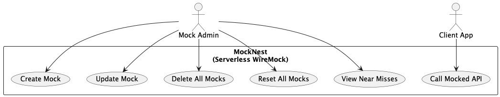
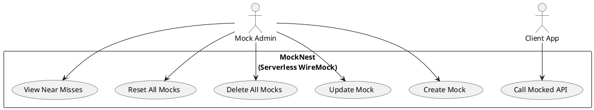

# Mock Nest
## Use cases
Some example use cases are shown below, however full API list is available here: [wiremock-admin-api.json](software/application/src/main/resources/wiremock-admin-api.json).

_View with PlantUML IntelliJ plugin_


## Solution Architecture


# Using the Mock (cURL quickstart)
The mock server exposes the WireMock Admin API under the `__admin` path and your mocked endpoints under their own paths.

Below are copy-paste-ready cURL examples for the most common scenarios, followed by links to the Postman collections with many more examples.

Prerequisites:
- Set base URL and keys as environment variables depending on your deployment target.

Azure Function App:
- Admin operations (create/update/delete mappings): use the admin function key
- Client calls (calling your mocked endpoints): use the mocknest function key
```
export AZURE_URL="https://<your-app>.azurewebsites.net"
export ADMIN_FUNCTION_KEY="<your-admin-function-key>"
export CLIENT_FUNCTION_KEY="<your-mocknest-function-key>"
```

AWS API Gateway:
- Both admin and client calls are protected with an API key
```
export AWS_URL="https://<api-id>.execute-api.<region>.amazonaws.com/prod"
export API_KEY="<your-api-key>"
```

Notes:
- Replace the headers accordingly in the examples: Azure uses `x-functions-key`, AWS uses `x-api-key`.
- The complete Admin API is documented here: [wiremock-admin-api.json](software/application/src/main/resources/wiremock-admin-api.json)
- This app normalizes mapping bodies on save: when you POST/PUT `/__admin/mappings` with `persistent: true` and an inline `body`/`base64Body`, the response body is stored in storage and the mapping is rewritten to use `bodyFileName` automatically.

1) Reset all mappings
- Azure
```
curl -i -X POST "$AZURE_URL/__admin/mappings/reset" \
  -H "x-functions-key: $ADMIN_FUNCTION_KEY"
```
- AWS
```
curl -i -X POST "$AWS_URL/__admin/mappings/reset" \
  -H "x-api-key: $API_KEY"
```

2) Create a simple REST mapping
Creates a stub for `GET /api/hello` that returns JSON. Marked `persistent: true` so the body is externalized and `bodyFileName` is used.
- Azure
```
curl -i -X POST "$AZURE_URL/__admin/mappings" \
  -H "x-functions-key: $ADMIN_FUNCTION_KEY" \
  -H "Content-Type: application/json" \
  --data @- <<'JSON'
{
  "id": "11111111-1111-1111-1111-111111111111",
  "priority": 1,
  "request": {
    "method": "GET",
    "url": "/api/hello"
  },
  "response": {
    "status": 200,
    "headers": { "Content-Type": "application/json" },
    "body": "{\"message\":\"Hello from MockNest!\"}"
  },
  "persistent": true
}
JSON
```
- AWS
```
curl -i -X POST "$AWS_URL/__admin/mappings" \
  -H "x-api-key: $API_KEY" \
  -H "Content-Type: application/json" \
  --data @- <<'JSON'
{
  "id": "11111111-1111-1111-1111-111111111111",
  "priority": 1,
  "request": { "method": "GET", "url": "/api/hello" },
  "response": {
    "status": 200,
    "headers": { "Content-Type": "application/json" },
    "body": "{\"message\":\"Hello from MockNest!\"}"
  },
  "persistent": true
}
JSON
```

3) Update an existing mapping by ID
Replace `<UUID>` with the mapping ID created earlier.
- Azure
```
curl -i -X PUT "$AZURE_URL/__admin/mappings/<UUID>" \
  -H "x-functions-key: $ADMIN_FUNCTION_KEY" \
  -H "Content-Type: application/json" \
  --data @- <<'JSON'
{
  "id": "<UUID>",
  "priority": 1,
  "request": { "method": "GET", "url": "/api/hello" },
  "response": {
    "status": 200,
    "headers": { "Content-Type": "application/json" },
    "body": "{\"message\":\"Hello UPDATED!\"}"
  },
  "persistent": true
}
JSON
```
- AWS
```
curl -i -X PUT "$AWS_URL/__admin/mappings/<UUID>" \
  -H "x-api-key: $API_KEY" \
  -H "Content-Type: application/json" \
  --data @- <<'JSON'
{
  "id": "<UUID>",
  "priority": 1,
  "request": { "method": "GET", "url": "/api/hello" },
  "response": {
    "status": 200,
    "headers": { "Content-Type": "application/json" },
    "body": "{\"message\":\"Hello UPDATED!\"}"
  },
  "persistent": true
}
JSON
```

4) List all mappings
- Azure
```
curl -s "$AZURE_URL/__admin/mappings" -H "x-functions-key: $ADMIN_FUNCTION_KEY" | jq .
```
- AWS
```
curl -s "$AWS_URL/__admin/mappings" -H "x-api-key: $API_KEY" | jq .
```

5) Delete all mappings
- Azure
```
curl -i -X DELETE "$AZURE_URL/__admin/mappings" -H "x-functions-key: $ADMIN_FUNCTION_KEY"
```
- AWS
```
curl -i -X DELETE "$AWS_URL/__admin/mappings" -H "x-api-key: $API_KEY"
```

6) Call your mocked endpoint
Using the stub created in step 2 (`GET /api/hello`).
- Azure (client calls use the mocknest function key):
```
curl -s "$AZURE_URL/api/hello" -H "x-functions-key: $CLIENT_FUNCTION_KEY" | jq .
```
- AWS:
```
curl -s "$AWS_URL/api/hello" -H "x-api-key: $API_KEY" | jq .
```

SOAP example
The Postman collections also include a SOAP Calculator example (request to `/dneonline/calculator.asmx`). You can POST the corresponding mapping via Admin API and call the SOAP endpoint similarly. See the collections below.

# Clean Architecture


For explanation, see:
* [**Live Coding Featuring This Imlementation @Voxxed Days Amsterdam (April 3, 2025)**](https://www.youtube.com/watch?v=wz0GQbkrr1Q)

# Project Structure

```
kotlin-spring-cloud-function-clean-architecture-demo/
│
├── build.gradle.kts     // Root build file
├── settings.gradle.kts  // Contains include statements for subprojects
│
├── .github/             // GitHub-specific configuration
│   └── workflows/       // GitHub Actions workflow definitions
│       ├── feature-aws.yml                  // Triggers AWS deployment for feature branches
│       ├── feature-azure.yml                // Triggers Azure deployment for feature branches
│       ├── main-aws.yml                     // Triggers AWS deployment for main branch
│       ├── main-azure.yml                   // Triggers Azure deployment for main branch
│       ├── workflow-build-deploy-aws.yml    // Reusable workflow for AWS Lambda build and deployment
│       └── workflow-build-deploy-azure.yml  // Reusable workflow for Azure Function build and deployment
│
├── docs/               // Documentation files
│   └── postman/                 // Postman collections and environments
│       ├── AWS MockNest Conf Demo.postman_collection.json    // Collection for AWS app
│       ├── Azure MockNest Conf Demo.postman_collection.json  // Collection for Azure app
│       ├── Health Checks.postman_collection.json             // Collection for Initial health checks on AWS app and Azure app
│       └── Demo Example.postman_environment.json             // Environment variables for both deployments
│
├── software/            // Holds all the business logic and application code
│   ├── domain/
│   │   ├── src/
│   │   └── build.gradle.kts
│   ├── application/
│   │   ├── src/
│   │   └── build.gradle.kts
│   └── infra/            // Infrastructure specific code
│       ├── aws/          // AWS-specific code, including AWS Lambda
│       │   ├── src/
│       │   └── build.gradle.kts
│       └── azure/        // Azure-specific code, including Azure Function
│           ├── src/
│           └── build.gradle.kts
│
└── cdk/                  // Terraform CDK Kotlin code
    ├── aws/
    │   ├──src/
    │   ├──build.gradle.kts
    │   ├──cdktf.out/            // Generated by generateTerraform.sh
    │   ├──generated/            // Generated by generateTerraform.sh
    │   └──generateTerraform.sh  // Generates terraform json from CDK, run when infrastructure changes
    └── azure/
        ├──src/
        ├──build.gradle.kts
        ├──cdktf.out/            // Generated by generateTerraform.sh
        ├──generated/            // Generated by generateTerraform.sh
        └──generateTerraform.sh  // Generates terraform json from CDK, run when infrastructure changes

```

# Spring Cloud Function


For explanation, see:
* [**Live Coding Featuring This Imlementation @Voxxed Days Amsterdam (April 3, 2025)**](https://www.youtube.com/watch?v=wz0GQbkrr1Q)

# Getting Started
## Prerequisites
Before you begin, ensure you have the following:

- **Java 21** or later installed
- Git for version control
- Gradle (the project uses the Gradle wrapper, so you don't need to install it separately)
- IDE of your choice (IntelliJ IDEA recommended for Kotlin development)

### Cloud Provider Requirements
This project can be deployed to either AWS or Azure or both. Depending on your target environment, you'll need:

#### AWS Account Requirements
- An AWS account with permissions to:
  - Create and manage Lambda functions
  - Create and manage API Gateway resources
  - Create and manage IAM roles and policies
  - Create and manage S3 buckets
  - Deploy AWS resources via Terraform

#### Azure Account Requirements
- An Azure account with permissions to:
  - Create and manage Azure Functions
  - Create and manage Storage accounts
  - Create and manage Application Insights
  - Assign roles to managed identities
  - Deploy Azure resources via Terraform

## Build Project
After checking out the project, ensure it can build properly by running:
```bash
./gradlew build
```
from the root of the project.

## Update Infrastructure
If you plan to deploy the infrastructure, you may need to update the following:

### AWS
- Update the AWS region in the workflow file if needed (default is "eu-west-1")
- The S3 bucket for Terraform state is set to "kotlin-lambda-terraform-state" (this bucket must exist before deployment)
- The S3 bucket for Lambda deployment is set to "lambda-deployment-clean-architecture-example"

### Azure
- Update the Azure resource group name (default is "DefaultResourceGroup-WEU")
- Update the Azure region if needed (default is "West Europe")
- The storage account for MockNest is set to "demomocknest" (this storage account must exist before deployment)
- The storage container for Terraform state is set to "vintikterraformstorage" (this container must exist in the storage account before deployment)

Ensure to run `generateTerraform.sh` after any infra changes in the appropriate cdk module (aws or azure) to regenerate terraform configuration.

## Configure Pipeline

> ⚠️ **Security Notice**  
> This demo project does **not** use OpenID Connect for simplicity. For an example project that uses OpenID Connect, see https://github.com/elenavanengelenmaslova/kotlin-clean-architecture-example-docs-flow.
> If you are deploying to company environments, always follow your organization's security policies and configure GitHub Actions with proper role-based access control. 

If you are using GitHub Actions for deployment, you'll need to configure the following repository secrets:

### AWS Deployment Secrets
- `AWS_ACCOUNT_ID`: Your AWS account ID
- `AWS_ACCESS_KEY`: Your AWS access key
- `AWS_SECRET_KEY`: Your AWS secret key

### Azure Deployment Secrets
- `AZURE_SUBSCRIPTION_ID`: Your Azure subscription ID
- `AZURE_CLIENT_ID`: Your Azure client ID
- `AZURE_CLIENT_SECRET`: Your Azure client secret
- `AZURE_TENANT_ID`: Your Azure tenant ID
- `AZURE_STORAGE_ACCOUNT_NAME`: Your Azure storage account name
- `AZURE_STORAGE_ACCOUNT_ACCESS_KEY`: Your Azure storage account access key

## Testing: Postman Collections and Environment
The `docs/postman` directory contains Postman collections and an environment file for testing the MockNest API:

### Collections
- **AWS MockNest Conf Demo.postman_collection.json**: Collection for testing the MockNest API deployed on AWS
- **Azure MockNest Conf Demo.postman_collection.json**: Collection for testing the MockNest API deployed on Azure
- **Health Checks.postman_collection.json**: Collection for running both AWS and Azure health checks

AWS and Azure collections contain requests for:
- Creating mock API endpoints
- Testing mock endpoints
- Resetting mappings
- Viewing near misses (requests that almost matched a mapping)
- Checking the health of the service
- Deleting mappings

Health Check collection is a shortcut to run all health checks at once.

### Environment
- **Demo Example.postman_environment.json**: Contains environment variables used by both collections

#### Environment Configuration
Before using the collections, you need to configure the environment variables:

**For AWS deployment:**
- `AWS_URL`: Set to your AWS API Gateway endpoint
- `api_key`: Set to your AWS API Gateway API key

**For Azure deployment:**
- `AZURE_URL`: Set to your Azure Function App endpoint
- `admin_function_key`: Set to your Azure Function admin key (for admin operations)
- `client_function_key`: Set to your Azure Function mocknest key (for client operations)

### How to use the Postman collections
1. Open Postman and Import the files from `docs/postman`:
   - `AWS MockNest Conf Demo.postman_collection.json`
   - `Azure MockNest Conf Demo.postman_collection.json`
   - `Demo Example.postman_environment.json`
2. Select the imported environment and fill in variables:
   - For AWS: `AWS_URL`, `api_key`
   - For Azure: `AZURE_URL`, `admin_function_key`, `client_function_key`
3. Run the folders in the collection in order:
   - Reset mappings
   - Create mapping(s)
   - Call mocked API
   - View near misses / list mappings
   - Delete mappings
4. Refer back to the Use Cases diagram at the top of this README to understand typical flows.

## Questions or Issues
If you have questions or encounter issues, please log them in the repository's issue tracker:
[https://github.com/elenavanengelenmaslova/kotlin-spring-cloud-function-clean-architecture-demo/issues](https://github.com/elenavanengelenmaslova/kotlin-spring-cloud-function-clean-architecture-demo/issues)

## Reference Documentation

For further reference, please consider the following sections:

* [**Live Coding Featuring This Imlementation @Voxxed Days Amsterdam (April 3, 2025)**](https://www.youtube.com/watch?v=wz0GQbkrr1Q): *Clean Architecture for Serverless: Business Logic You Can Take Anywhere*
* [Alternative Example of Clean Architecture for Serverless in Action](https://github.com/elenavanengelenmaslova/kotlin-clean-architecture-example-docs-flow)
* [OpenID Connect in AWS](https://docs.github.com/en/actions/security-for-github-actions/security-hardening-your-deployments/configuring-openid-connect-in-amazon-web-services)
* [OpenID Connect in Azure](https://docs.github.com/en/actions/security-for-github-actions/security-hardening-your-deployments/configuring-openid-connect-in-azure)
* [Official Gradle documentation](https://docs.gradle.org)
* [Spring Boot Gradle Plugin Reference Guide](https://docs.spring.io/spring-boot/docs/3.1.4/gradle-plugin/reference/html/)
* [Create an OCI image](https://docs.spring.io/spring-boot/docs/3.1.4/gradle-plugin/reference/html/#build-image)
* [Function](https://docs.spring.io/spring-cloud-function/docs/current/reference/html/spring-cloud-function.html)

### Additional Links

These additional references should also help you:

* [Gradle Build Scans – insights for your project's build](https://scans.gradle.com#gradle)
* [Various sample apps using Spring Cloud Function](https://github.com/spring-cloud/spring-cloud-function/tree/main/spring-cloud-function-samples)
